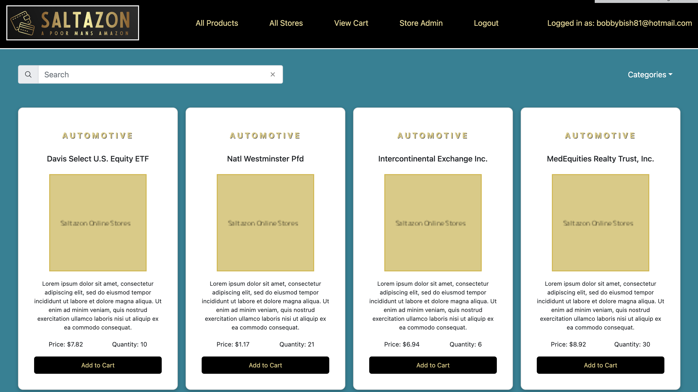

# eCommerce-AmazonClone-FE
The frontend of a e-commerce application

# Introduction
This is an eCommerce app (reminiscent of Amazon) users can both buy and put up their own products (So exactly how on Amazon.com sellers will have their own Store page with all of their products that they sell). A regular customer that visits the site should be able to view all the products from each of the stores and add whatever they find to their cart. And a store admin should be able to upload new products to the store that the customer should see.

Deployed link: https://saltazon-online.netlify.app

# Requirements
The app should be able to display all available products and store information once a user is logged in. A user can have one of two roles; Admin or User. 
A user is the customer and can add products to their cart, change quantity, remove products and save their cart in local storage.
Admin can add, change and delete products from the store the are assigned to, as per their unique Store Id. A user cannot access the admin page where changes to products occur. Only those with an 'admin' role can update product information.

Once the user is logged in, and redirected to the home page, all the products are displayed on the page. There should be a filter option and searchbar for products. Each product should have its own page, where you can add products to your cart. This cart should persist in local storage, and only be visible if that user is logged in.

Pagination has been added to the bottom of the home page.

A mock purchase can be made by the user by proceeding to checkout when viewing their cart. Once the user confirms their purchase, they are redirected back to the home page.
FYI - No request is sent to the backend to adjust the product quantities following a purchase, as this is just a mock order.

The admin page can only be accessed by those with 'admin' role. There is a form which once populated will send need products to the database and render the changes on submit.
Each product card has input fields where the price and quantity can be updated, aswell as full deletion of the product when submitting changes.

# Technologies
Vite •
React • 
Bootstrap • 
Mui/Material • 
Formik • 
Axios • 
Node JS

# Getting Started
Clone this repository then run the following commands: 
  - npm install
  - npm start

# further development
 - add css style rules for mobile
 - add super-admin feature to allow user to add/delete stores
 - adjust the product quantities on the backend following a purchase
 - create order up after checking out the cart. The user puts up an order, the store admin marks it as sent/ready to pick up and then the user marks it as picked up.
 - approve new stores
 - add employees to stores

# Author
<h3>Robert Bish</h3>

